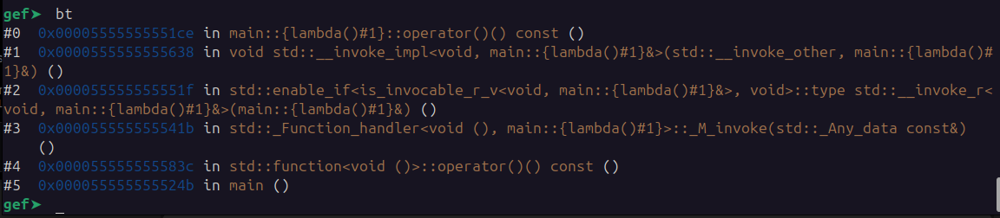

# Anonymous Functions in C++

This is just a very quick example of an anonymous (lambda) function in C++. While the direct call to the lambda is not incorrect, G++ adds some helper functions that introduce some indirection. It may be similar to a v-table according to Tullis. In this case, the trace to the lambda function is.  
  

As you can see, there is a large stack of functions leading to the stdout lambda function. There is an indirect call between #3 and #4, a call rdx instruction at file offset 0x183a.  

It Appears that Ghidra Desktop and Binja Desktop fail to calculate that reference. I confirmed the path and call stack in GDB and confirmed function addressed in Ghidra and Binja.
