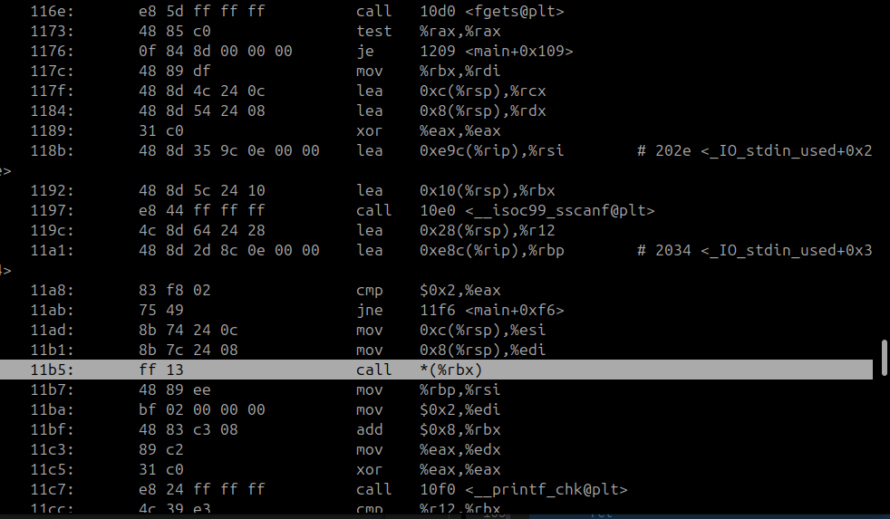
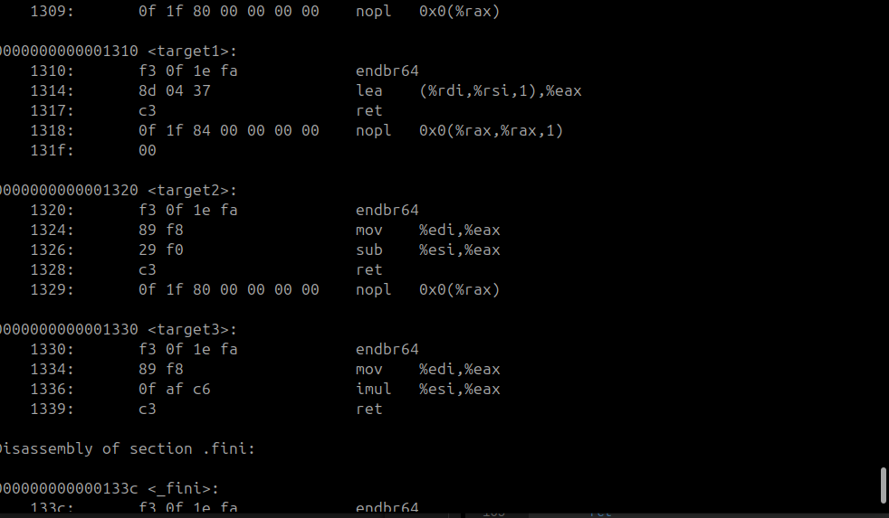

# 3 - CFR File   
   
To create a research question, you first need a CFR file.   
## CFR.json   
To work with the tools in `control_flow_recovery/analysis`, you will need a proper `-cfr.json` file. Go ahead and create one as such:   
   
```bash
touch enya-fptr_array-stripped-cfr.json
```
   
   
Notice the `-cfr.json` at the end of the file name. This is critical for the parser in tools.   
   
```JSON
{
    "program":"enya-fptr_array-stripped",
    "question":"What are the file offsets for the instructions that are the targets of the '$INSTRUCTION' instruction at file offset '$OFFSET' ?",
    "groundtruth": [],
    "evaluation":"set"
}
```
   
   
The four necessary fields are `program`, `question`, `groundtruth`, and `evaluation`. The program is a relative filepath to the `-cfr.json`. **The question requires exact wording** as tools currently rely on regex. The groundtruth contains the answers to the questions, and the evaluation is the format of the answers.   
   
Other helpful fields can be added as an aid to the human viewer.   
   
## Formatting Questions and Finding Ground Truth   
Knowing which indirect branch instruction is the correct question can be challenging. The silver lining is we are very interested in *minimal* examples.   
   
Objdump is one tool that can help with this. When working with C programs compiled as ELF by GCC, Objdump typically gives to us the file offset. Even better news is, stripping a binary does not affect the code sections, so we can use the same offsets we find in the non-stripped for the stripped. (Exception largely occurs when stripping object files.)   
   
```bash
objdump -d enya-fptr_array
```
   
   
Since we have our function calls in main, we should check for a call to a pointer. Objdump will make this obvious, and in our case, it was `call *(%rbx)` at offset `0x11b5`.   
   
   
   
The target of these calls are similarly also easy to find:   
   
   
From the examples above, we should be able to infer that the answers are `0x1310`, `0x1320`, and `0x1330`.   
   
Then we should be able to update our `-cfr.json` file with these offsets.   
   
```JSON
{
    "program":"enya-fptr_array-stripped",
    "question":"What are the file offsets for the instructions that are the targets of the 'call rbx' instruction at file offset '0x11b5' ?",
    "groundtruth": ["0x1310", "0x1320", "0x1330"],
    "evaluation":"set"
}
```
   
   
Run the validator script to confirm that the analysis tools will be able to find your CFR file.   
   
```bash
cd ~/suns-dataset/control_flow_recovery/analysis
./validate_cfr_files
```
   
   
Then use `./show_me_all_the_questions` to verify that at least one tool can process your question.   
   
```bash
./show_me_all_the_questions
```

There is also a ground truth validator for ELF binaries that prerequisites you to write source code where the only source of uncertainty is argc. Although some components are fragile, it is available for use:

```bash
python control_flow_recovery/analysis/validate_groundtruth_targets
```
   
   
## Challenge   
1. Create your own CFR file   
2. Validate your CFR file with the two helper scripts (make sure it works!)   
3. Once you have obtained good results with the two validators, push your new program directory to Github
